# Sistema de Algoritmos de Ordenamiento (SAV)

SAV (Sistema de Algoritmos de Ordenamiento) es una aplicación Java que permite ordenar y validar diferentes tipos de datos. La aplicación utiliza una interfaz de línea de comandos (CLI) para recibir datos de entrada y proporciona opciones para ordenarlos en función del tipo de datos.

## Requisitos
Para ejecutar el programa SAV, asegúrese de tener instalado lo siguiente:

Java Development Kit (JDK) 19.

## SDK

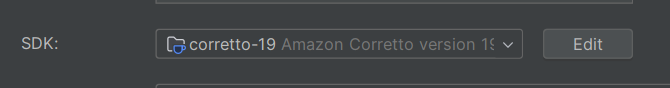

Un entorno de desarrollo Java (por ejemplo, Eclipse, IntelliJ IDEA) o un terminal para ejecutar comandos Java.
## Estructura del Proyecto
El proyecto SAV sigue una estructura de paquetes para organizar las diferentes partes del programa. A continuación, se muestra la estructura del proyecto:

    sav-project/
    ├── libs/
    │   └── sav.jar
    ├── src/
    │   ├── Core/
    │   │   ├── AbstractSAV.java
    │   │   ├── CharacterSAV.java
    │   │   ├── NumericSAV.java
    │   │   ├── InputProcessor.java
    │   │   ├── SAV.java
    │   │   └── ...
    │   ├── Parsing/
    │   │   ├── CharacterParser.java
    │   │   ├── IntegerParser.java
    │   │   ├── Parser.java
    │   │   └── ...
    │   ├── Sorting/
    │   │   ├── BubbleSort.java
    │   │   ├── InsertionSort.java
    │   │   ├── SelectionSort.java
    │   │   ├── Sortable.java
    │   │   ├── SortingFactory.java
    │   │   └── ...
    │   ├── Utils/
    │   │   ├── ResultProcessor.java
    │   │   ├── SortingValueAdapter.java
    │   │   └── ...
    ├── .gitignore
    ├── README.md
    └── ...

## Package: Main

**`SAV:`** Clase principal que contiene el método main y es el punto de entrada del programa.

## Package: Core

**AbstractSAV:** Clase abstracta que define la estructura básica para los algoritmos de ordenamiento.

**CharacterSAV:** Clase que hereda de AbstractSAV y se encarga de manejar el ordenamiento de caracteres.

**InputProcessor:** Clase que procesa las entradas del usuario y ejecuta el ordenamiento correspondiente.

**NumericSAV:** Clase que hereda de AbstractSAV y se encarga de manejar el ordenamiento de números.

## Package: Parsing

**CharacterParser:** Clase que convierte una cadena de caracteres en una lista de caracteres.

**IntegerParser:** Clase que convierte una cadena de números en una lista de enteros.

**Parser:** Interfaz que define el método parse para convertir una cadena en una lista de valores.

## Package: Sorting

**BubbleSort**: Clase que implementa el algoritmo Bubble Sort para ordenar una lista de enteros.

**InsertionSort**: Clase que implementa el algoritmo Insertion Sort para ordenar una lista de enteros.

**SelectionSort**: Clase que implementa el algoritmo Selection Sort para ordenar una lista de enteros.

**Sortable**: Interfaz que define el método sort para implementar diferentes algoritmos de ordenamiento.

**SortingFactory**: Clase que crea instancias de los diferentes algoritmos de ordenamiento.

## Package: Utils

**ArgumentProcessor**: Esta clase se encarga de procesar los argumentos de línea de comandos pasados al programa SAV. Analiza y valida los argumentos proporcionados para garantizar que estén en el formato correcto y extrae los valores relevantes, como el tipo de dato, el orden de clasificación, etc.

**ResultProcessor**: La clase ResultProcessor es responsable de procesar los resultados obtenidos después de realizar la clasificación y los valores asociados. Imprime los valores originales y el ordenado utilizando un renderizado especial en la consola, respetando los retrasos entre iteraciones y otros ajustes.

**SortingValueAdapter**: Esta clase implementa la interfaz ValueAdapter y se utiliza para convertir los valores de tipo String en valores numéricos, lo que permite a los algoritmos de ordenación procesar y comparar los valores adecuadamente.

**TypeInitializer**: Esta clase se encarga de inicializar y configurar los diferentes tipos de analizadores de datos y algoritmos de ordenación que se utilizarán en el programa SAV.

**ValueProcessor**: La clase ValueProcessor contiene métodos para procesar y adaptar los valores de entrada antes de realizar la clasificación. Esto podría incluir la validación y conversión de los valores según el tipo de dato.

# **Compilación y Ejecución**
Para compilar el programa SAV, sigue estos pasos:

**Abre una terminal o línea de comandos.
Navega al directorio raíz del proyecto sav.
Compila los archivos fuente Java con el siguiente comando:**

    javac -d bin src/Core/*.java src/Sorting/*.java src/Parsing/*.java src/Utils/*.java src/Main/*.java -Xlint:unchecked

Esto creará los archivos de clase compilados en el directorio bin.

# **Para ejecutar el programa SAV, sigue estos pasos:**

**Asegúrate de estar en el directorio raíz del proyecto sav.
Ejecuta el programa con el siguiente comando:**

    java -cp "out/production/sav-carlos-garcia;libs/*" Main.SAV a=s o=za in=r r=5 s=100 t=c

Reemplaza la opción t=n con el tipo de datos que deseas ordenar (n para numérico, c para caracter, etc.) y la opción v="10,5,-3,8,1" con los valores de entrada separados por comas.

# **Funcionalidades y Uso**

El programa SAV ofrece las siguientes funcionalidades:

**Ordenamiento de datos numéricos (t=n) en orden ascendente y descendente.
Ordenamiento de caracteres (t=c) en orden alfabético ascendente y descendente.**

Ordenamiento de datos de otro tipo no implementado, mostrando un mensaje de error.
Para utilizar el programa, proporciona los siguientes argumentos en la línea de comandos:

    java -cp "out/production/sav-carlos-garcia;libs/*" Main.SAV a=s o=za in=r r=5 s=100 t=c

## Opciones
 El programa acepta varias opciones para personalizar el proceso de ordenamiento:

-a o --algorithm: Especifica el algoritmo de ordenamiento a utilizar (BubbleSort, InsertionSort, SelectionSort).

-t o --type: Especifica el tipo de dato a ordenar (n para numérico, c para caracter).

-o o --order: Especifica el orden de ordenamiento (az para ascendente, za para descendente).

-in o --input: Especifica la forma de entrada de valores (r para rango, m para manual).

-r o --range: Especifica el rango de valores para la entrada en caso de seleccionar rango como forma de entrada.

-v o --values: Especifica la lista de valores separados por comas en caso de seleccionar manual como forma de entrada.

-s o --pause: Especifica el valor de pausa de retardo en milisegundos entre pasos del algoritmo.

## diagrama

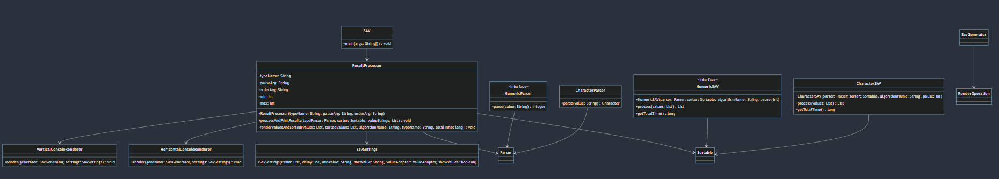

codigo mermaid:

    classDiagram
    class SAV {
        +main(args: String[]): void
    }

    class ResultProcessor {
        -typeName: String
        -pauseArg: String
        -orderArg: String
        -min: int
        -max: int
        +ResultProcessor(typeName: String, pauseArg: String, orderArg: String)
        +processAndPrintResults(typeParser: Parser<?>, sorter: Sortable<?>, valueStrings: List<String>): void
        -renderValuesAndSorted(values: List<String>, sortedValues: List<String>, algorithmName: String, typeName: String, totalTime: long): void
    }

    class NumericParser {
        <<interface>>
        +parse(value: String): Integer
    }

    class CharacterParser {
        +parse(value: String): Character
    }

    class NumericSAV {
        <<interface>>
        +NumericSAV(parser: Parser, sorter: Sortable, algorithmName: String, pause: int)
        +process(values: List<String>): List<String>
        +getTotalTime(): long
    }

    class CharacterSAV {
        +CharacterSAV(parser: Parser, sorter: Sortable, algorithmName: String, pause: int)
        +process(values: List<String>): List<String>
        +getTotalTime(): long
    }

    class SavSettings {
        +SavSettings(items: List, delay: int, minValue: String, maxValue: String, valueAdapter: ValueAdapter, showValues: boolean)
    }

    class HorizontalConsoleRenderer {
        +render(generator: SavGenerator, settings: SavSettings): void
    }

    class VerticalConsoleRenderer {
        +render(generator: SavGenerator, settings: SavSettings): void
    }

    SAV --> ResultProcessor
    ResultProcessor --> Parser
    ResultProcessor --> Sortable
    ResultProcessor --> SavSettings
    ResultProcessor --> HorizontalConsoleRenderer
    ResultProcessor --> VerticalConsoleRenderer
    NumericParser --> Parser
    CharacterParser --> Parser
    NumericSAV --> Sortable
    CharacterSAV --> Sortable
    SavGenerator --> RenderOperation

## ejemplo de ejecucion:

**Caracter:**

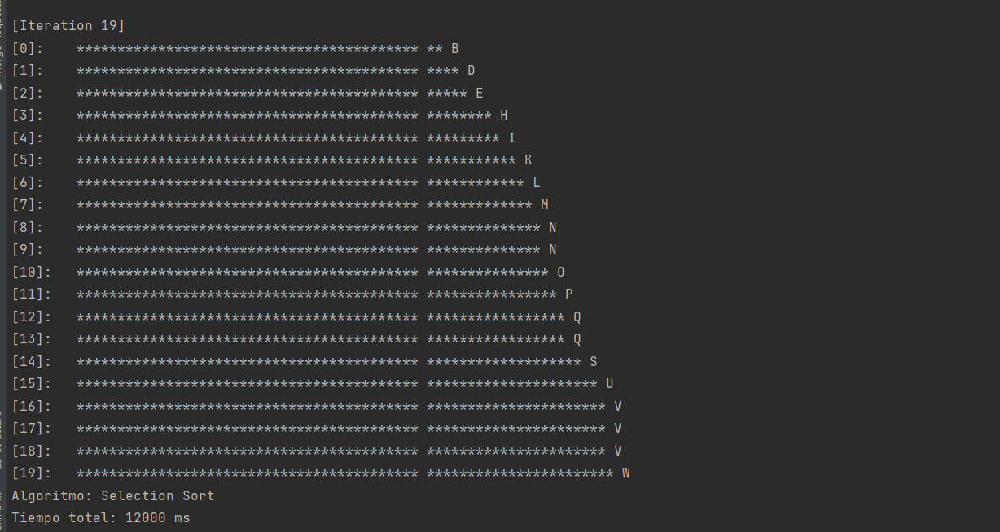

**Numerico:**

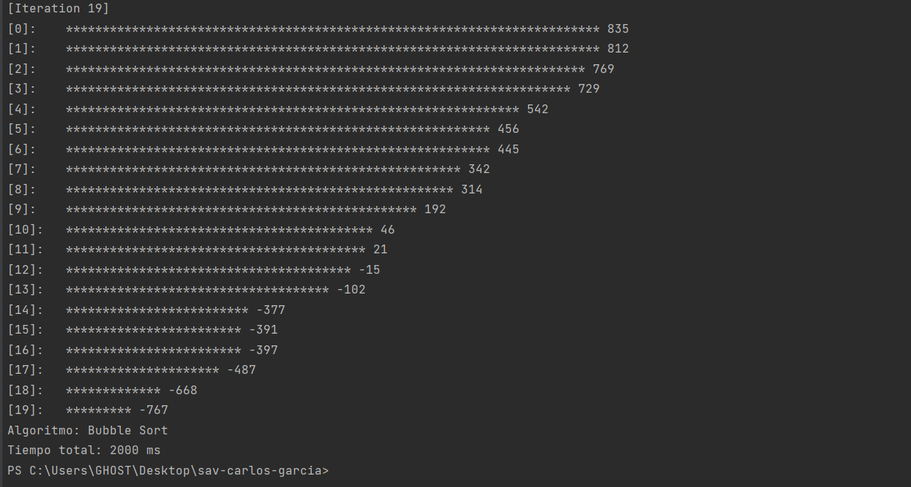
Parámetro "a", solo debe aceptar 3 valores definidos por el programa

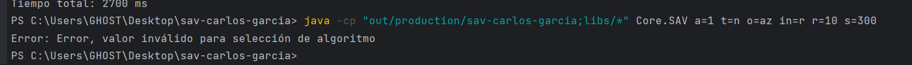

Parámetro "t", solo debe aceptar 2 valores "c" o  "n"

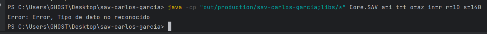

Parámetro "o", solo debe aceptar 4 posibles valores "az", "za", "AZ", "ZA"

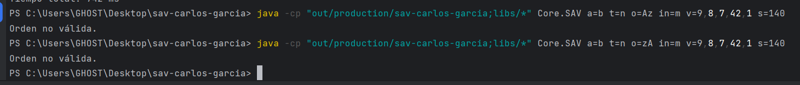

Parámetro "in", solo debe aceptar 4 posible valores "r","R","M" o "m"

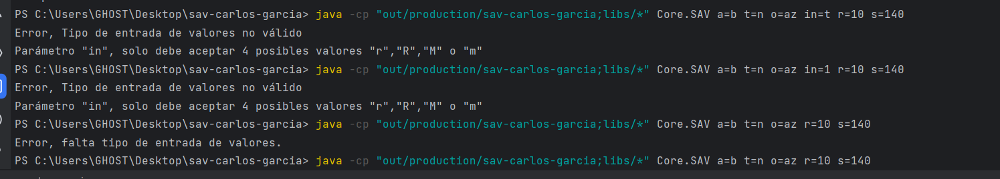

Parámetro v esta condicionado a los valores "in=m" y "t=c/n".

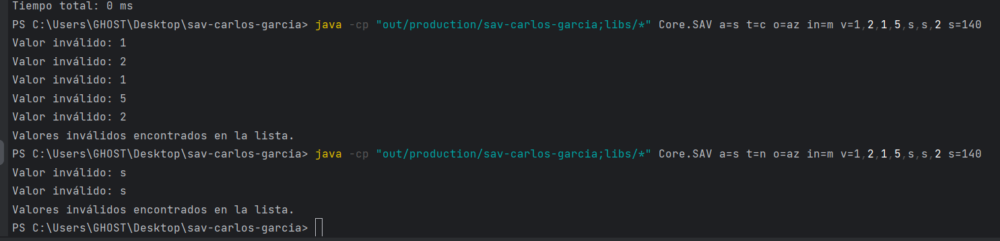

Parámetro "r" solo acepta valores entre 1 y 40
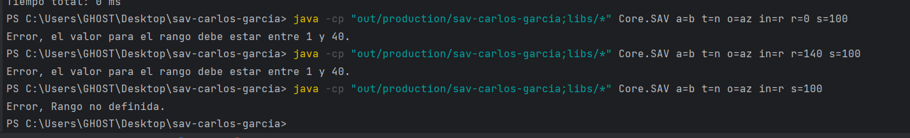

Parámetro "s" solo acepta valores entre 100 y 1000
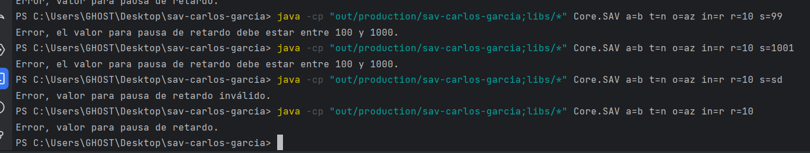

CARLOS G.